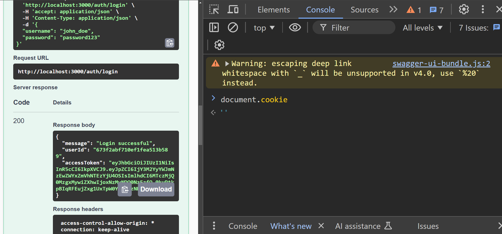

# Authentication System with JWT

This project is a lightweight authentication system designed to handle user registration, login, and token-based authentication. The system uses JWT (JSON Web Tokens) for secure access management and supports refresh tokens stored in HttpOnly cookies for enhanced security.

## Technologies Used

### Backend
- **Node.js**: Backend runtime environment.
- **Express.js**: Web framework for handling API requests and middleware.
- **MongoDB**: NoSQL database for storing user data.
- **Mongoose**: Object Data Modeling (ODM) library for MongoDB.

### Authentication
- **JWT**: Token-based authentication for access and refresh tokens.
- **Bcrypt**: Password hashing for secure storage.
- **Rate-Limiter**: Middleware for preventing abuse through rate-limiting.
- **Helmet**: Adds security headers to protect against common vulnerabilities.
- **Cors**: Enables cross-origin resource sharing for API requests.

### Tests
- **Jest**: Testing framework for ensuring code reliability.
- **Postman**: Tool for sending API requests and checking responses.
- **Swagger**: API documentation and testing interface.
- **jest-html-reporters**: Generates detailed HTML test reports.
- **mongodb-memory-server**: In-memory MongoDB instance for fast and isolated testing.

### Another Tools
- **Winston**: Logging library for error and activity tracking.
- **Dotenv**: Manage sensitive configurations through environment variables.
- **Prettier**: Enforce consistent code formatting.
- **http-status-codes**: Provides readable HTTP status codes.

---
## Security Considerations

Security is a critical aspect of this project. Here are some key decisions made to enhance security:

### Why Use Two Tokens?
1. **Access Token**:
   - Short-lived token (e.g., 15 minutes).
   - Used to authenticate requests to protected resources.
   - If compromised, its short lifetime limits potential damage.

2. **Refresh Token**:
   - Long-lived token (e.g., 7 days).
   - Stored in a secure HttpOnly cookie, preventing JavaScript access.
   - Used only to generate new Access Tokens, keeping the application more secure.

### Why Store Access Token in Memory?
Access Tokens are stored in the memory of the Single Page Application (SPA) instead of LocalStorage or Cookies. This decision was made because:
- **Prevents XSS attacks**: Unlike LocalStorage, tokens in memory are not exposed to malicious scripts.
- **Simplifies token lifecycle management**: Tokens are cleared when the browser is refreshed, requiring a new token to be fetched via the Refresh Token.

### Why Use HttpOnly Cookies for Refresh Tokens?
HttpOnly cookies ensure that the Refresh Token:
- **Cannot be accessed by JavaScript**, protecting against XSS attacks.
- Is automatically sent with each request to the `/auth/refresh` endpoint.

Below is an example of how HttpOnly cookies behave in the browser console:

#### Without HttpOnly
In this scenario, cookies can be accessed via JavaScript, exposing them to potential attacks:


#### With HttpOnly
When HttpOnly is enabled, cookies are not accessible via JavaScript, providing better security:


---

## Installation
### Requirements
- Node.js version 20.12+
- MongoDB version 7.0+
1. Clone the repository:

   ```bash
   git clone https://github.com/adimalka14/dog-adapters.git
   cd dog-adapters

2. Install dependencies:

   ```bash
   npm install
3. Run the application:
- build of typescript and run js compiled project
   ```bash
    npm run build
   ```
    ```bash
    npm run start

- or runs typescript code for development with nodemon
   ```bash
    npm run dev
      

The app will run on http://localhost:3000.

---
---
## Testing
The project includes tests for key functionalities, including:
- User authentication and session management.
- CRUD operations for users and dogs.
- Validation and error handling.
  
 To run the tests:

   ```bash
   npm test
```
### Test Coverage
The current test coverage for the project is as follows:


## API Documentation

The API is fully documented and available via **Swagger**.  
To explore and test the API endpoints:

1. Start the server:
   ```bash
   npm start
2. Open your browser and navigate to:
   ```bash
   http://localhost:3000/api-docs
*(Replace `localhost` and the port with your server's host and port if different.)*

#### This documentation provides an interactive interface for testing and exploring all available endpoints.
## Swagger Preview

Below is a preview of the Swagger API documentation:

<div style="max-height: 400px; overflow-y: scroll; border: 1px solid #ccc; padding: 10px;">
    
</div>
