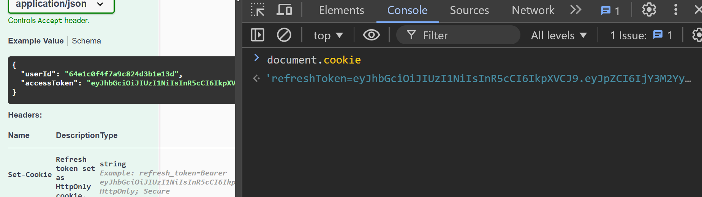
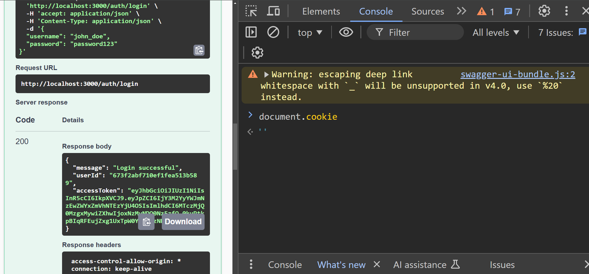
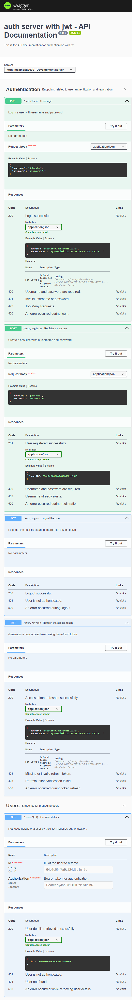

# Authentication System with JWT

This project is a lightweight authentication system designed to handle user registration, login, and token-based authentication. The system uses JWT (JSON Web Tokens) for secure access management and supports refresh tokens stored in HttpOnly cookies for enhanced security.

## Technologies Used

### Backend
- **Node.js**: Backend runtime environment.
- **Express.js**: Web framework for handling API requests and middleware.
- **MongoDB**: NoSQL database for storing user data.
- **Mongoose**: Object Data Modeling (ODM) library for MongoDB.

### Authentication
- **JWT**: Token-based authentication for access and refresh tokens.
- **Bcrypt**: Password hashing for secure storage.
- **Rate-Limiter**: Middleware for preventing abuse through rate-limiting.
- **Helmet**: Adds security headers to protect against common vulnerabilities.
- **Cors**: Enables cross-origin resource sharing for API requests.

### Tests
- **Jest**: Testing framework for ensuring code reliability.
- **Postman**: Tool for sending API requests and checking responses.
- **Swagger**: API documentation and testing interface.
- **jest-html-reporters**: Generates detailed HTML test reports.
- **mongodb-memory-server**: In-memory MongoDB instance for fast and isolated testing.

### Another Tools
- **Winston**: Logging library for error and activity tracking.
- **Dotenv**: Manage sensitive configurations through environment variables.
- **Prettier**: Enforce consistent code formatting.
- **http-status-codes**: Provides readable HTTP status codes.

---
## Security Considerations

Security is a critical aspect of this project. Here are some key decisions made to enhance security:

### Why Use Two Tokens?
1. **Access Token**:
   - Short-lived token (e.g., 15 minutes).
   - Used to authenticate requests to protected resources.
   - If compromised, its short lifetime limits potential damage.

2. **Refresh Token**:
   - Long-lived token (e.g., 7 days).
   - Stored in a secure HttpOnly cookie, preventing JavaScript access.
   - Used only to generate new Access Tokens, keeping the application more secure.

### Why Store Access Token in Memory?
Access Tokens are stored in the memory of the Single Page Application (SPA) instead of LocalStorage or Cookies. This decision was made because:
- **Prevents XSS attacks**: Unlike LocalStorage, tokens in memory are not exposed to malicious scripts.
- **Simplifies token lifecycle management**: Tokens are cleared when the browser is refreshed, requiring a new token to be fetched via the Refresh Token.

### Why Use HttpOnly Cookies for Refresh Tokens?
HttpOnly cookies ensure that the Refresh Token:
- **Cannot be accessed by JavaScript**, protecting against XSS attacks.
- Is automatically sent with each request to the `/auth/refresh` endpoint.

Below is an example of how HttpOnly cookies behave in the browser console:

#### Without HttpOnly
In this scenario, cookies can be accessed via JavaScript, exposing them to potential attacks:
```javascript
res.cookie('refreshToken', refreshToken, {
  // httpOnly: true, // Uncommenting this line would enable HttpOnly, preventing JavaScript access
  secure: NODE_ENV === 'production', // Use Secure only in production (HTTPS-only)
  sameSite: 'strict', // Limits cookie to same-site requests, helping prevent CSRF
  maxAge: WEEK, // Cookie expiration (e.g., one week)
});
```


#### With HttpOnly
When HttpOnly is enabled, cookies are not accessible via JavaScript, providing better security:
```javascript
res.cookie('refreshToken', refreshToken, {
  httpOnly: true, // The cookie is not accessible by client-side scripts
  secure: NODE_ENV === 'production', // Use Secure only in production (HTTPS-only)
  sameSite: 'strict', // Limits cookie to same-site requests, helping prevent CSRF
  maxAge: WEEK, // Cookie expiration (e.g., one week)
});
```


### Cross-Origin Resource Sharing (CORS)
CORS (Cross-Origin Resource Sharing) is a security mechanism that controls how resources on the server are accessed by clients from different domains. By default, browsers block cross-origin requests for security reasons.

In this project:
- **CORS is enabled globally** to allow requests from any origin during development.
- For production, you can restrict access to specific domains by configuring the `origin` option in the `cors` middleware.

#### Example
Here is how CORS is configured in this project:
```javascript
const cors = require('cors');

// Enable CORS for all origins during development
app.use(cors());

// Example for restricting access in production:
app.use(cors({
  origin: 'https://yourdomain.com', // Replace with your UI domain
  credentials: true, // Allow cookies to be sent
}));
```
---

## Installation
### Requirements
- Node.js version 20.12+
- MongoDB version 7.0+
1. Clone the repository:

   ```bash
   git clone https://github.com/adimalka14/auth-server-jwt.git
   cd auth-server-jwt

2. Install dependencies:

   ```bash
   npm install
3. Run the application: 
    ```bash
    npm run start

The app will run on http://localhost:3000.

---
---
## Testing
The project includes End-to-End tests that validate the complete flow of authentication, including registration, login, logout, and token refresh functionality. These tests ensure that the system behaves as expected from the perspective of a client interacting with the API.
  
 To run the tests:

   ```bash
   npm test
```
### Test Coverage
The current test coverage for the project is as follows:

## Postman Documentation

You can find the Postman collection for this project [here](docs/postman/jwtserver.postman_collection.json).

To use it:
1. Download the JSON file.
2. Import it into Postman by selecting `Import` and uploading the file.
3. Use the predefined requests to interact with the API.


## API Documentation

The API is fully documented and available via **Swagger**.  

#### This documentation provides an interactive interface for testing and exploring all available endpoints.
## Swagger Preview

<div style="max-height: 400px; overflow-y: scroll; border: 1px solid #ccc; padding: 10px;">
    
</div>
